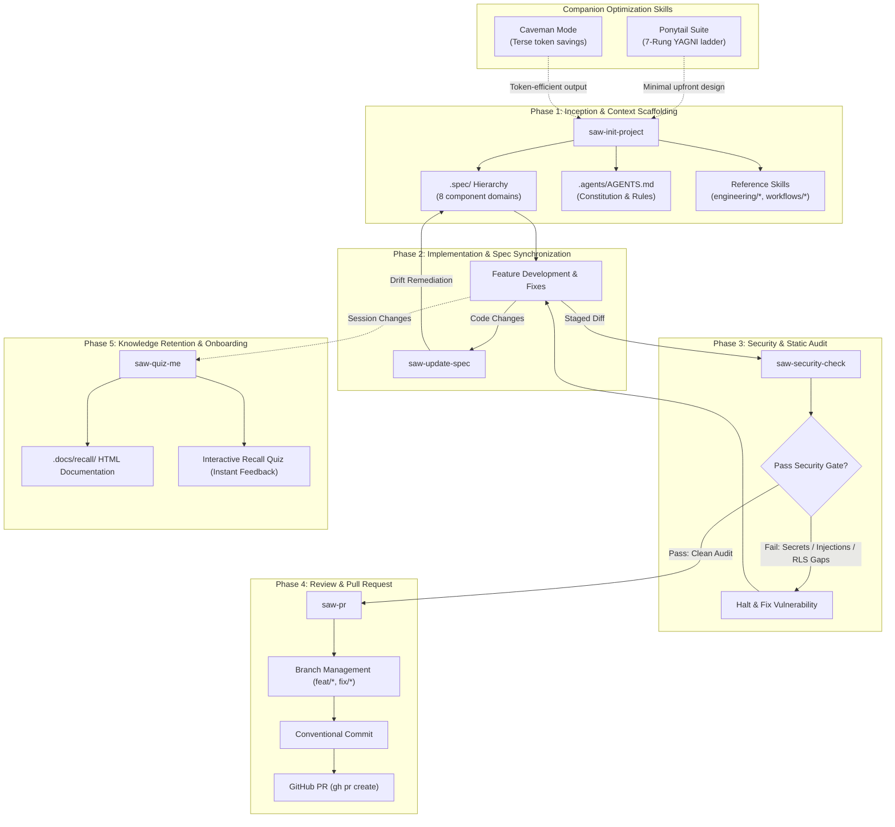

# SDLC Agent Workflow (`saw-*`)

A unified suite of AI agent skills and engineering workflows designed for full-lifecycle software development.

The SDLC Agent Workflow suite enforces modular project truth, security-first validation, automated specification synchronization, and token-efficient execution across every phase of development.

---

## SDLC Lifecycle Skills

| Skill | SDLC Phase | Purpose | Location |
| :--- | :--- | :--- | :--- |
| **`saw-init-project`** | Phase 1: Inception & Context Scaffolding | Scaffolds modular `.spec/` hierarchy, `.agents/AGENTS.md`, and reference skills | [saw-init-project/](./saw-init-project/) |
| **`saw-update-spec`** | Phase 2: Implementation & Spec Synchronization | Analyzes recent codebase changes and updates `.spec/` subcomponents to eliminate documentation drift | [saw-update-spec/](./saw-update-spec/) |
| **`saw-security-check`** | Phase 3: Security & Static Audit | Audits active diffs for hardcoded secrets, injection vectors, missing RLS policies, and vulnerable dependencies | [saw-security-check/](./saw-security-check/) |
| **`saw-pr`** | Phase 4: Review & Pull Request | Mandates security check pass, manages feature branches, generates conventional commits, and opens GitHub PRs | [saw-pr/](./saw-pr/) |
| **`saw-quiz-me`** | Phase 5: Knowledge Retention & Onboarding | Synthesizes recent sessions into offline interactive HTML documentation and self-assessment recall quizzes | [saw-quiz-me/](./saw-quiz-me/) |

---

## SDLC Lifecycle Flow Diagram



---

## Suite Architecture

```text
sdlc-agent-workflow/
|-- LICENSE                            (MIT License)
|-- README.md                          (Suite overview)
|-- saw-init-project/                  (Modular context scaffolding)
|   |-- SKILL.md
|   |-- README.md
|   |-- scripts/
|   |   `-- init-project.ps1
|   |-- skills/                        (Reference procedural skills)
|   |   |-- engineering/               (architecture, api, database, security, testing, git)
|   |   `-- workflows/                 (planning, implementation, debugging, code-review, release)
|   `-- templates/
|       |-- AGENTS.md
|       |-- README.md
|       |-- requirements/
|       |-- architecture/
|       |-- diagrams/                  (Use-case & system sequence diagrams)
|       |-- api/
|       |-- data-model/
|       |-- legal-documents/           (Privacy policy & terms of service)
|       |-- development/
|       `-- decisions/
|-- saw-security-check/                (Static vulnerability & secret audit)
|   |-- SKILL.md
|   |-- README.md
|   `-- scripts/
|       `-- security-check.ps1
|-- saw-pr/                            (Conventional commit & GitHub PR automation)
|   |-- SKILL.md
|   `-- README.md
|-- saw-update-spec/                   (Continuous spec-code alignment)
|   |-- SKILL.md
|   `-- README.md
`-- saw-quiz-me/                       (Interactive recall documentation & quiz)
    |-- SKILL.md
    `-- README.md
```

---

## Core Engineering Directives

### 1. Ponytail Planning Upfront
The SDLC suite leverages the **Ponytail** optimization skill to prevent over-engineering and eliminate speculative complexity before code is written.

#### How the Agent Discovers and Calls Ponytail
- **Automatic Context Ingestion**: When the agent initializes or plans changes (in `saw-init-project` or `saw-security-check`), it reads `.agents/skills/ponytail/SKILL.md` (or `~/.agents/skills/ponytail/SKILL.md`) into context.
- **Natural Language Triggers**: The agent triggers Ponytail whenever user requests include: `"be lazy"`, `"simplest solution"`, `"minimal solution"`, `"yagni"`, `"do less"`, `"shortest path"`, or complaints about over-engineering.
- **Slash Commands & Intensity Modes**:
  - `/ponytail lite`: Builds what is requested, but proposes the laziest alternative in one line.
  - `/ponytail` (or `full`): Enforces the decision ladder as default. Shortest diff and shortest explanation.
  - `/ponytail ultra`: YAGNI extremist. Deletion before addition; challenges requirements before building.
  - `/ponytail-help`: Quick-reference card displaying all modes, skills, and command syntax without changing session state.
- **Ponytail Skill Suite**:
  | Skill | Trigger / Command | Purpose |
  | :--- | :--- | :--- |
  | **`ponytail`** | `/ponytail [lite\|full\|ultra]` | Active lazy mode enforcing the 7-rung decision ladder |
  | **`ponytail-help`** | `/ponytail-help` | Quick-reference card for commands, levels, and configuration |
  | **`ponytail-review`** | `/ponytail-review` | Code review hunting exclusively for over-engineering and bloat |
  | **`ponytail-audit`** | `/ponytail-audit` | Whole-repository audit identifying dead code and unneeded abstractions |
  | **`ponytail-debt`** | `/ponytail-debt` | Harvests `ponytail:` comments into a tracked technical debt ledger |
  | **`ponytail-gain`** | `/ponytail-gain` | Displays measured impact scoreboard (lines cut, tokens saved, speed) |

#### The 7-Rung Decision Ladder
Always stop at the first rung that holds:
1. **YAGNI**: Question whether the abstraction needs to exist at all.
2. **Codebase Reuse**: Reuse existing helpers, types, and patterns before writing new ones.
3. **Standard Library**: Prefer stdlib over third-party dependencies.
4. **Native Platform**: Use native platform features (e.g., HTML/CSS, database constraints) before writing application code.
5. **Installed Dependencies**: Use already-installed packages before adding new ones.
6. **One-Liner**: If it can be one line, make it one line.
7. **Minimal Code**: Write only the minimum surgical code that fulfills the requirement.

### 2. Caveman Token Efficiency
To prevent context overflow and reduce token consumption, agent communication defaults to Caveman mode (terse, essential technical statements without conversational filler).
- **Explicit Exception**: Legal specifications (`privacy-policy.md`, `terms-of-service.md`) are exempt from compression and must remain fully formal and exhaustive.

### 3. Environment Variable Security
Agents are strictly prohibited from opening, inspecting, or committing private environment files (`.env`, `.env.local`, `.env.production`). Agents must rely exclusively on publicly available `.env.example` templates.

### 4. Zero Emojis
Emojis are strictly avoided in code, commit messages, diagrams, and technical documentation.

---

## Installation & Deployment

To make these skills available to Antigravity agents:

### Workspace Installation
Copy the desired skill folders into your project's `.agents/skills/` directory:
```powershell
Copy-Item -Recurse "path\to\sdlc-agent-workflow\saw-*" "C:\path\to\target-project\.agents\skills\"
```

### Global Installation
Alternatively, link or copy skills to your user-level customization root:
```powershell
Copy-Item -Recurse "path\to\sdlc-agent-workflow\saw-*" "$HOME\.agents\skills\"
```
Antigravity automatically discovers and loads skills located in `.agents/skills/` without requiring manual workflow registrations.
