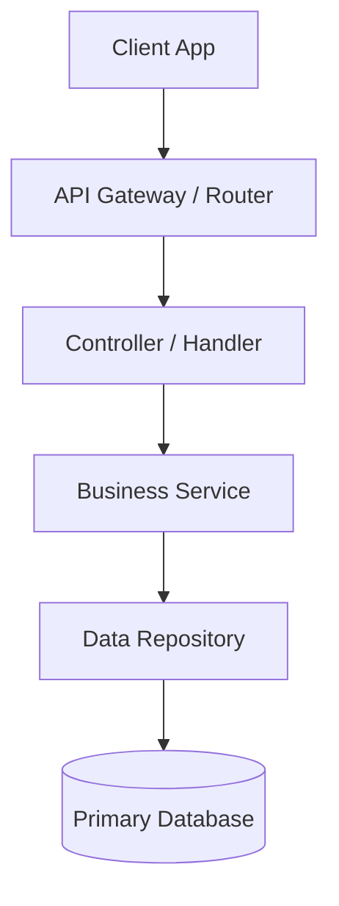

# Data Flow & Sequences

## End-to-End Request Flow

```mermaid
flowchart TD
    Client[Client App] --> Gateway[API Gateway / Router]
    Gateway --> Controller[Controller / Handler]
    Controller --> Service[Business Service]
    Service --> Repository[Data Repository]
    Repository --> Database[(Primary Database)]
```

## Key Asynchronous / Background Flows

## Interservice Communication Protocols
