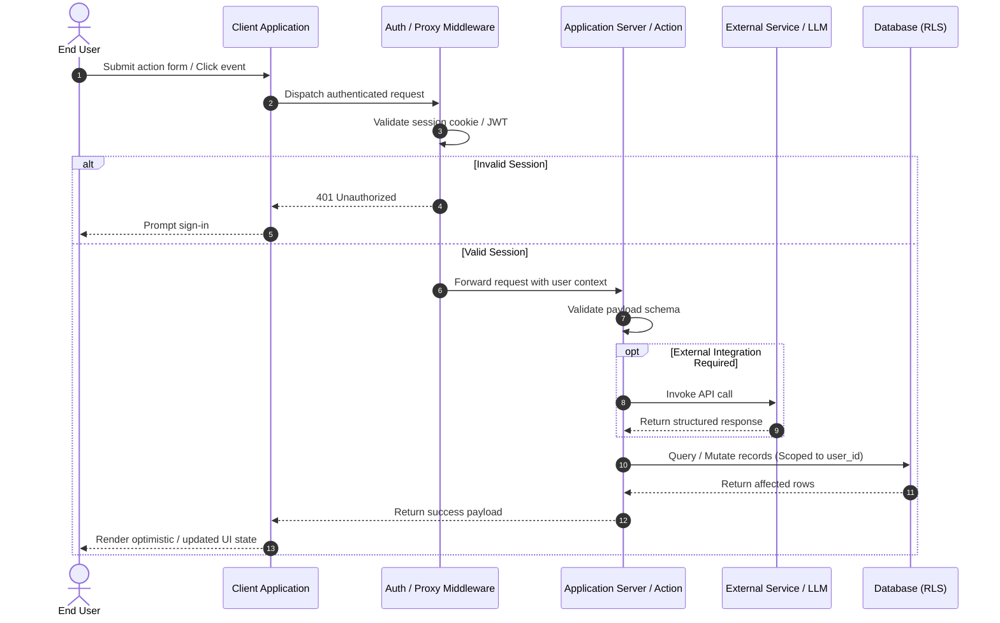

# System Sequence & Data Flow Diagram

This document illustrates the sequence of interactions, boundaries, and data transformations across client, server, background workers, and persistent stores.

---

## 1. Request Lifecycle Sequence

---

## 2. Key Data Flow Guarantees
- **Tenant Scoping**: All database mutations require explicit user identifier binding or Row Level Security policy evaluation.
- **Input Sanitization**: Client-side validation is accompanied by strict server-side schema verification.
- **Error Propagation**: Unhandled exceptions are logged with scrubbed PII, returning non-leaking user-safe error codes.
