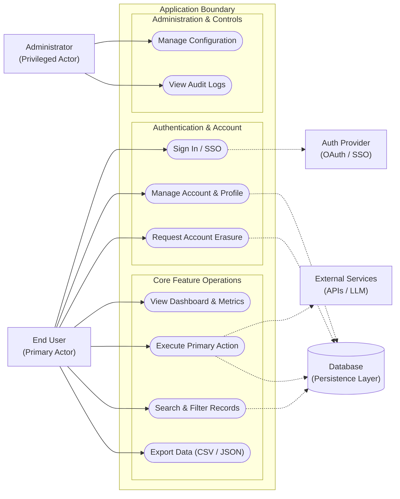

# System Use Case Diagram

This document defines the behavioral and functional use cases for the system, illustrating the interactions between human actors, the system boundary, and external cloud/third-party services.

---

## 1. Actors

### Primary Actors
- **End User**: The primary operator or consumer interacting with the user interface to execute core workflows and review outputs.
- **Administrator**: Privileged user managing configurations, user accounts, and administrative controls.

### Secondary & External System Actors
- **AI Agent Engine**: Autonomous or semi-autonomous processors executing background tasks, analysis, or structured pipelines.
- **External Identity Provider (Auth)**: Third-party OAuth / SSO provider managing user identity tokens.
- **External API / Third-Party Services**: Upstream data APIs, messaging systems, or LLM providers.
- **Database / Persistence Layer**: Primary database enforcing relational constraints, Row Level Security, or data isolation.

---

## 2. Use Case Diagram

---

## 3. Detailed Use Case Specifications

### UC-01: Primary Action Execution
- **Actor**: End User
- **Preconditions**: User is authenticated and possesses active tenant permissions.
- **Trigger**: User initiates the primary action from the dashboard.
- **Main Success Scenario**:
  1. System validates inputs and checks permissions.
  2. System processes request or invokes external service.
  3. System records transaction in the database.
  4. System returns structured confirmation to the user.
- **Extensions / Error Scenarios**:
  - *Invalid Input*: System halts execution and renders field-level validation errors.
  - *External Service Unavailable*: System retries with exponential backoff or gracefully degrades.

### UC-02: Account & Data Erasure
- **Actor**: End User
- **Preconditions**: User is authenticated.
- **Trigger**: User requests complete account deletion per Privacy Policy.
- **Main Success Scenario**:
  1. System prompts for user confirmation.
  2. System cascades deletion across all tenant-owned records.
  3. System terminates active sessions and revokes tokens.
